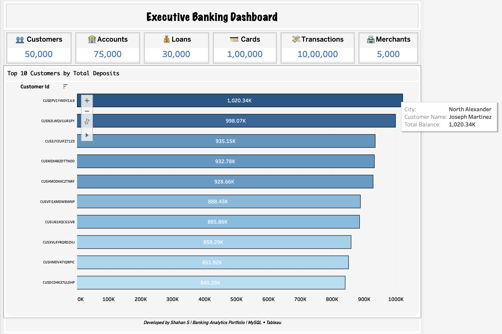
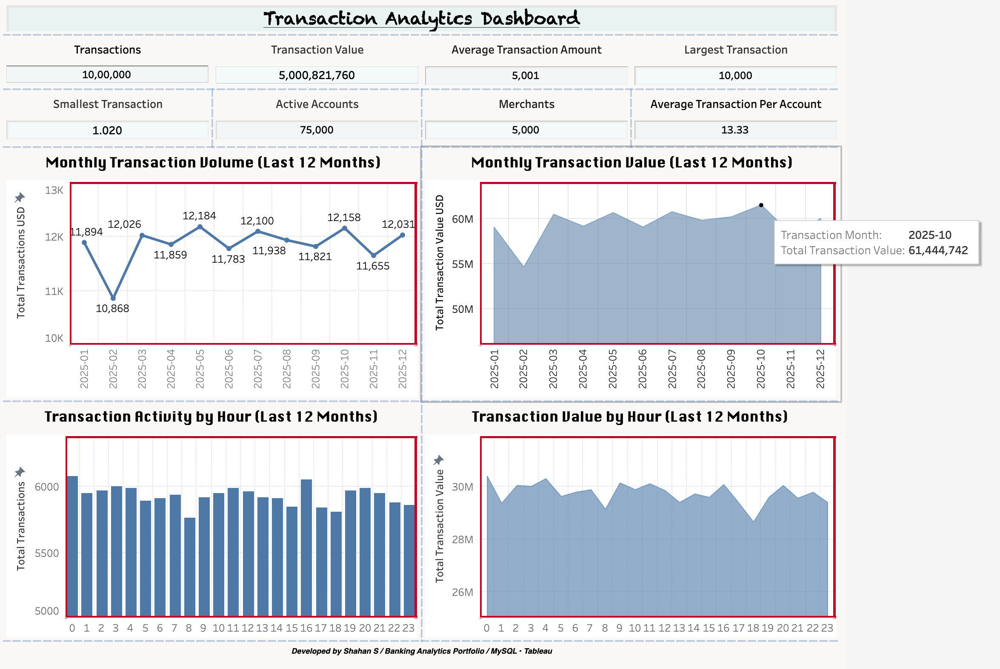
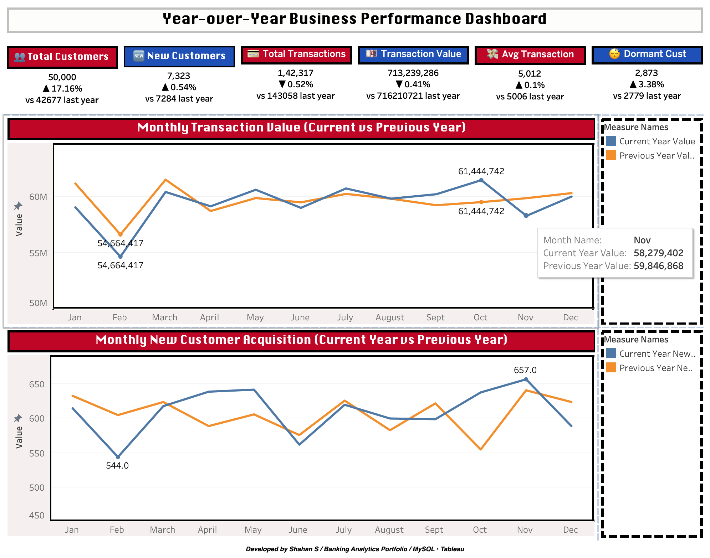

## Retail Banking Analytics

SQL-driven analytics project simulating a retail banking environment, focused on uncovering customer behaviour, transaction patterns, and financial product performance through structured query design.

---

### Objective
To design and implement a structured analytical framework for retail banking data, enabling deep-dive analysis into customer activity, financial behaviour, and product utilisation using SQL.

---

### Business Context
Retail banks rely on data-driven insights to optimise customer engagement, manage financial risk, and improve product performance.  
This project replicates a real-world analytical environment where transactional and customer data are leveraged to support strategic decision-making across core banking functions.

---

### Data Source
The dataset used in this project is sourced from Kaggle:

- Synthetic Retail Banking Dataset  
  https://www.kaggle.com/datasets/akrambelha/synthetic-banking-dataset-csv-sql-sqlite  

The dataset was ingested and transformed into a relational schema to support structured analytical workflows.

---

### Data Modeling
A relational schema was designed to normalize and structure the dataset into multiple interconnected tables representing customers, accounts, transactions, cards, and loans.  

The entity relationships and table dependencies were modeled using Lucidchart to ensure referential integrity and efficient query performance.  

The schema design follows normalized principles to minimize redundancy while enabling scalable analytical queries.

---

### Data Visualization (Tableau)

To complement the SQL-based analytical framework, interactive dashboards were developed in Tableau to transform complex query outputs into intuitive and decision-oriented visual insights.

The dashboards act as a presentation layer, enabling faster interpretation of patterns, trends, and key performance indicators derived from the underlying data.

- Simplifies complex analytical outputs into visual narratives  
- Enables rapid identification of trends, anomalies, and behavioural patterns  
- Supports stakeholder-level decision making through KPI-driven views  
- Bridges the gap between raw data analysis and business interpretation  

---

### Dashboards

#### 1. Executive Banking Dashboard

A high-level strategic overview designed for executive stakeholders, consolidating key performance indicators across the banking ecosystem.

- Aggregated KPIs capturing deposits, customer base, and overall activity  
- Identification of top 10 customers by deposit contribution  
- Insight into financial concentration and high-value client dependency  

---

#### 2. Transaction Analytics Dashboard

A temporal and behavioural analysis of transaction activity, focusing on volume, frequency, and usage patterns.

- Monthly transaction trends to identify growth and seasonality patterns  
- Hourly transaction distribution to detect peak activity windows  
- KPI layer highlighting transaction intensity, averages, and anomalies  
- Enables understanding of customer engagement and channel utilisation  

---

#### 3. Year-over-Year Business Performance Dashboard

A longitudinal performance analysis comparing key banking metrics across time.

- Year-over-year comparison of core financial indicators  
- Growth trajectory analysis across accounts, transactions, and balances  
- Identification of expansion trends and potential slowdowns  
- Supports strategic planning and performance benchmarking  

---

### Data Architecture & Preparation

- Database schema design and normalisation  
- Data ingestion and transformation from raw sources  
- Data validation to ensure consistency and integrity  
- Indexing strategies applied for query performance optimisation  

---

### Analytical Framework

The project is structured into multiple analytical phases, each targeting a specific business domain within retail banking.

#### Phase 1: Business Overview
- Evaluated customer distribution across demographic and geographic dimensions  
- Analysed account composition by type, status, and lifecycle stage  
- Established baseline KPIs for overall banking activity  

#### Phase 2: Customer Analytics
- Performed customer segmentation based on transactional behaviour and account activity  
- Identified high-value and high-engagement customer cohorts  
- Analysed behavioural patterns to support targeted decision-making  

#### Phase 3: Transaction Analytics
- Assessed transaction volume and value distributions across channels  
- Identified dominant transaction categories and usage trends  
- Analysed temporal patterns to uncover peak activity periods  

#### Phase 4: Account Analytics
- Evaluated account utilisation and balance distribution  
- Identified dormant and highly active accounts  
- Analysed relationships between account types and transaction behaviour  

#### Phase 5: Card Analytics
- Analysed card usage patterns across customer segments  
- Evaluated transaction frequency and spending behaviour for card holders  
- Identified key trends in card-based financial activity  

#### Phase 6: Loan Analytics
- Analysed loan distribution across product categories  
- Evaluated repayment behaviour and outstanding balances  
- Identified potential indicators of credit risk  

#### Phase 7: Stored Procedures
- Developed reusable SQL procedures for modular and scalable analysis  
- Automated repetitive analytical workflows  
- Improved maintainability and execution efficiency  

---

### Key Insights

- Customer deposits are concentrated among a small number of high-value customers  
- Behavioural transaction analysis highlights anomalous patterns for potential fraud detection  
- Dormant high-balance accounts indicate untapped engagement opportunities  
- Low-balance, high-activity accounts suggest potential overdraft risk  
- Customers with loans exceeding deposits exhibit elevated financial risk exposure  
- Card lifecycle analysis supports proactive renewal and retention strategies  
- Consolidated financial profiling enables faster credit and relationship decision-making  

---

### Repository Structure

- `sql/` → database setup, validation, indexing, and analytical queries  
- `dataset/` → dataset reference and sourcing information  
- `docs/` → schema diagram and dashboard visuals  
- `results/` → analytical outputs and query result samples  

---

### Skills Demonstrated

- Advanced SQL querying and optimisation  
- Data modelling and relational schema design  
- Analytical problem structuring  
- Behavioural and financial data analysis  
- Performance tuning using indexing  
- Modular query design using stored procedures  
- Data visualization and storytelling using Tableau  

---

### Tools & Technologies

SQL (MySQL) • Tableau • Relational Database Systems • Data Modelling (Lucidchart) • Excel (Data Validation)

---

### Author
Shahan
