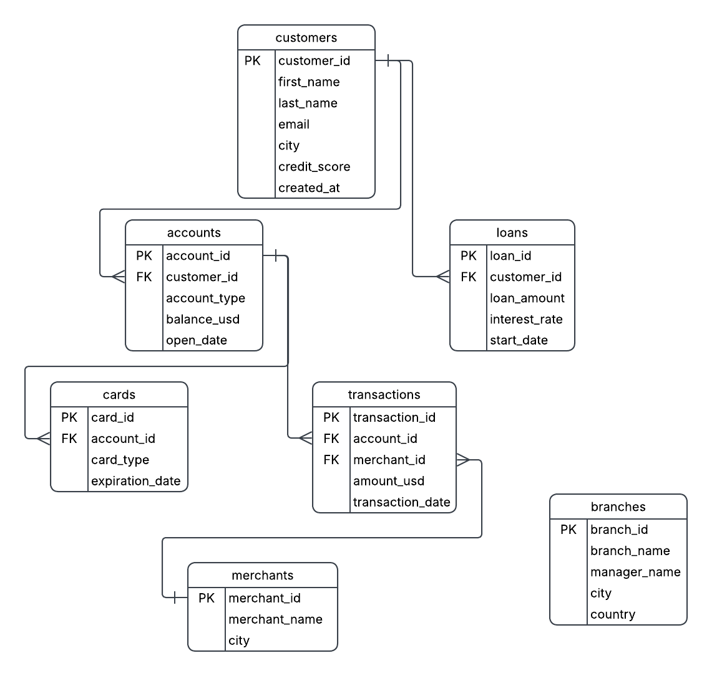

## Retail Banking Analytics
Comprehensive SQL-driven analytics project focused on extracting actionable insights from a synthetic retail banking dataset, covering customer behaviour, transaction dynamics, account performance, and credit risk indicators.

### Objective
To design and implement a structured analytical framework for retail banking data, enabling deep-dive analysis into customer activity, financial behaviour, and product utilisation using SQL.

### Data Source
The dataset used in this project is sourced from Kaggle:
- Synthetic Retail Banking Dataset  
  https://www.kaggle.com/datasets/akrambelha/synthetic-banking-dataset-csv-sql-sqlite
The dataset was ingested and transformed into a relational schema to support structured analytical workflows.

### Data Modeling
A relational schema was designed to normalize and structure the dataset into multiple interconnected tables representing customers, accounts, transactions, cards, and loans.
The entity relationships and table dependencies were modeled using Lucidchart to ensure referential integrity and efficient query performance.
The schema design follows normalized principles to minimize redundancy while enabling scalable analytical queries.

### Data Architecture & Preparation
- Database schema design and normalisation
- Data ingestion and transformation from raw sources
- Data validation to ensure consistency and integrity
- Indexing strategies applied for query performance optimisation
  
### Analytical Framework
The project is structured into multiple analytical phases, each targeting a specific business domain within retail banking.

#### Phase 1: Business Overview
- Evaluated customer distribution across demographic and geographic dimensions  
- Analysed account composition by type, status, and lifecycle stage  
- Established baseline KPIs for overall banking activity
  
#### Phase 2: Customer Analytics
- Performed customer segmentation based on transactional behaviour and account activity  
- Identified high-value and high-engagement customer cohorts  
- Analysed behavioural patterns to support targeted decision-making
  
#### Phase 3: Transaction Analytics
- Assessed transaction volume and value distributions across channels  
- Identified dominant transaction categories and usage trends  
- Analysed temporal patterns to uncover peak activity periods
  
#### Phase 4: Account Analytics
- Evaluated account utilisation and balance distribution  
- Identified dormant and highly active accounts  
- Analysed relationships between account types and transaction behaviour  

#### Phase 5: Card Analytics
- Analysed card usage patterns across customer segments  
- Evaluated transaction frequency and spending behaviour for card holders  
- Identified key trends in card-based financial activity
  
#### Phase 6: Loan Analytics
- Analysed loan distribution across product categories  
- Evaluated repayment behaviour and outstanding balances  
- Identified potential indicators of credit risk
  
#### Phase 7: Stored Procedures
- Developed reusable SQL procedures for modular and scalable analysis  
- Automated repetitive analytical workflows  
- Improved maintainability and execution efficiency  

### Repository Structure
- `sql/` → database setup, validation, indexing, and analytical queries  
- `dataset/` → dataset reference and sourcing information
  
### Skills Demonstrated
- Advanced SQL querying and optimisation  
- Data modelling and schema design  
- Analytical problem structuring  
- Behavioural and financial data analysis  
- Performance tuning using indexing  
- Modular query design using stored procedures  

### Tools & Technologies
MySQL • Relational Databases • Excel (supporting validation)

### Author
Shahan
